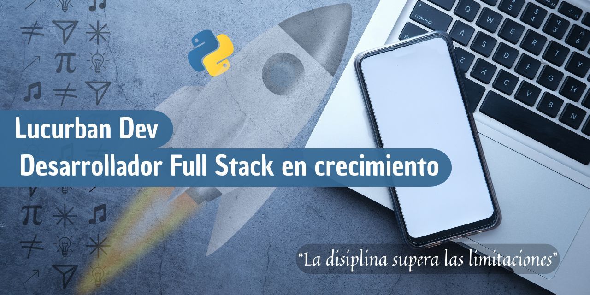

## 🌟 Hi! I'm Lucas 👋

#### 💻 An apasionate for the software develop

## 👨‍💻 About me
Although I'm just starting out, I'm clear that with discipline and perseverance I'll become a high-level Full Stack developer.

## 🚧 Project in development
I'm currently working on my first project after completing the Python course.

It's an application that allows you to:

🏪 Read a store's inventory.  
💲 Record sales.  
📉 Automatically update inventory.  

## 🛠️ Technologies used

## Contact me 📫
📨 lucurban@gmail.com  
 +57 304 352 8449 

##
## 🌟 Hola! Soy Lucas 👋

#### 💻 Un apasionado por el desarrollo de software

## Acerca de mi 👨‍💻
Aunque estoy dando mis primeros pasos, tengo claro que con disciplina y constancia voy a convertirme en un desarrollador Full Stack de alto nivel. 🚀

## 🚧 Proyecto en desarrollo
Actualmente estoy trabajando en mi primer proyecto después de completar el curso de Python.

Es una aplicación que permite:

🏪 Leer el inventario de una tienda.  
💲 Registrar ventas realizadas.  
📉 Actualizar el inventario automáticamente.

## 🛠️ Tecnologías usadas

## Contacto 📫
  
📨 lucurban@gmail.com  
 +57 304 352 8449 
