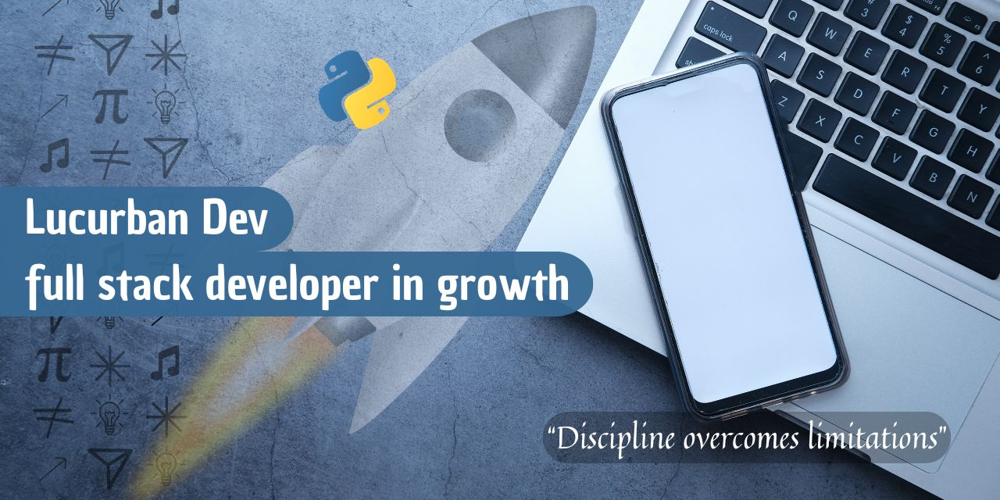

## 🌟 Hi! I'm Lucas 👋

#### 💻 An apasionate for the software develop

## 👨‍💻 About me
Although I'm just starting out, I'm clear that with discipline and perseverance I'll become a high-level Full Stack developer.

## 🚧 Project in development
I'm currently working on my first project after completing the Python course.

It's an application that allows you to:

🏪 Read a store's inventory.  
💲 Record sales.  
📉 Automatically update inventory.  

## 🛠️ Technologies used

## Contact me 📫
📨 lucurban@gmail.com  
 +57 304 352 8449 

##
## 🌟 Hola! Soy Lucas 👋

#### 💻 Un apasionado por el desarrollo de software

## Acerca de mi 👨‍💻
Aunque estoy dando mis primeros pasos, tengo claro que con disciplina y constancia voy a convertirme en un desarrollador Full Stack de alto nivel. 🚀

Soy desarrollador en formación con enfoque en trabajo remoto, combinando bases sólidas en ingeniería, diseño y desarrollo web. Me caracterizo por cerrar proyectos funcionales, aprender rápido y aplicar un pensamiento estructurado a cada reto.

“Me gusta pensar que cada proyecto nace de una chispa de inspiración, y con disciplina y creatividad se transforma en algo funcional y bonito.”

## 🎯 Perfil profesional
Soy Ingeniero de Materiales con experiencia en diseño CAD, actualmente enfocado en mi transición al desarrollo web. Esta combinación me permite abordar los proyectos con una visión técnica, ordenada y orientada a la solución de problemas reales.
Busco oportunidades remotas donde pueda aportar valor desde el primer día, mientras sigo creciendo como desarrollador.

## 🚀 Proyecto destacado
### 🛒 TiendApp – Versión 1
Aplicación desarrollada en Python, orientada a la gestión básica de una tienda, utilizando pandas y openpyxl para el manejo y persistencia de datos.

#### Estado: 
✅ Versión 1 finalizada

#### Tecnologías utilizadas:

- Python
- pandas (procesamiento y análisis de datos)
- openpyxl (lectura y escritura de archivos Excel)

#### Enfoque de desarrollo:

- Programación Orientada a Objetos (POO)

#### Este proyecto demuestra:

- Capacidad para llevar una idea de principio a fin
- Uso práctico de librerías para resolver necesidades reales
- Organización y estructura del código
- Enfoque en funcionalidad antes de escalar
- Disciplina para cerrar versiones estables

#### Aprendizajes clave:

- Estructuración completa de un proyecto en Python
- Manipulación de datos con pandas
- Integración de archivos Excel como fuente y destino de información
- Importancia de la simplicidad y la claridad

TiendApp refleja mi forma de trabajar: avanzar paso a paso, cerrar ciclos y mejorar de manera constante.

### 🌱 Actualmente estoy trabajando en

- Desarrollo de mi portafolio web como práctica real de HTML

- Estudiando y aplicando CSS para mejorar diseño y experiencia visual

- Planeación de mejoras para TiendApp – Versión 2

## 🛠️ Habilidades técnicas
### Desarrollo web
- HTML
- CSS (en aprendizaje activo)
- Fundamentos de lógica y estructura de proyectos

### Ingeniería y diseño
- Ingeniería de Materiales
- Diseño CAD
- Pensamiento analítico y resolución de problemas

### Trabajo remoto
- Autonomía y disciplina
- Aprendizaje constante
- Comunicación clara y enfoque en resultados

## 📫 Conectemos

Si buscas a alguien con mentalidad de crecimiento, base técnica fuerte y compromiso real con el aprendizaje y el trabajo bien hecho, este perfil es un buen punto de partida.

📨 lucurban@gmail.com  
 +57 304 352 8449 

Gracias por pasar por aquí ✨
